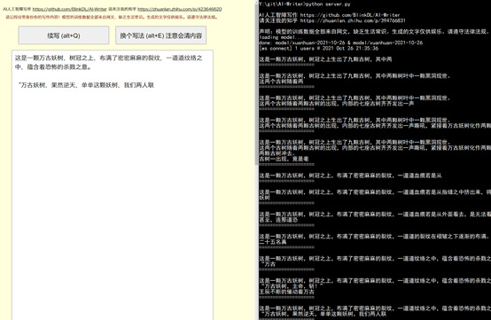
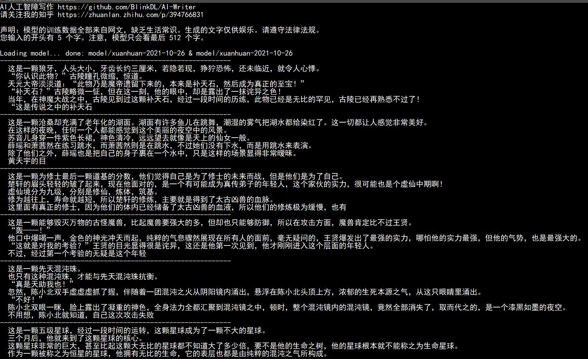
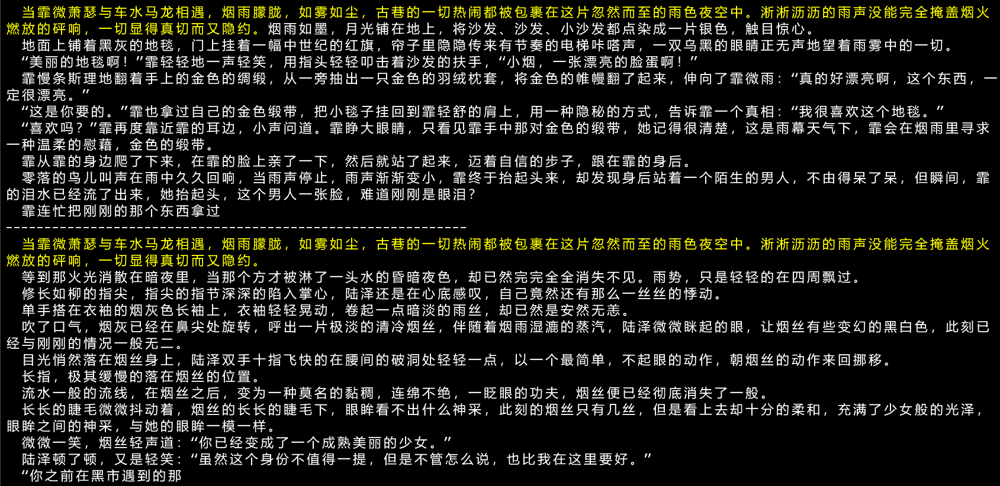
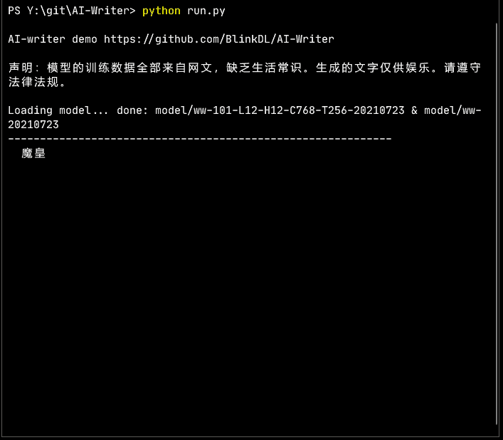

# 最新项目：ChatRWKV https://github.com/BlinkDL/ChatRWKV 有更强的 1.5B/3B/7B 开源网文大模型。
# 最新教程：https://zhuanlan.zhihu.com/p/609154637
# 下面都是过时的信息！过时的模型！仅供参考！

# AI-Writer
AI 写小说，支持 N/A/I卡 GPU 加速。采用我的 RWKV 模型，比 GPT 更快，训练代码：https://github.com/BlinkDL/RWKV-LM 。

N卡模型：https://github.com/BlinkDL/AI-Writer/releases/tag/v2022-02-15

A/I卡模型：https://github.com/BlinkDL/AI-Writer/releases/tag/v2022-02-15-A

**小白用户请看网页版： https://blinkdl.github.io/AI-Writer/ （弱很多，但手机点开就能写）**

Python版安装方法：
1. 先看下面的【安装方法】。下载模型，在右边 Release（或者看QQ群文件），解压到 model 目录。
2. 运行 python run.py（或双击run.bat），建议在cmd运行，看出错提示。有问题请看【安装方法】和【常见问题】。

也支持 CPU exe 生成，下载请加：用户 QQ 群 553456870（加入时请简单自我介绍）。有研发能力的朋友加群 325154699。还有用户TG群：https://t.me/ai_writer 。

**另外请大家看，本页面的最后，我会解释模型的原理，不懂电脑也能懂。**

Python版网页界面：执行 python server.py（或双击server.bat）然后打开 web-client 中的 index.html（推荐用Chrome）。



注意：模型的训练数据全部来自网文，缺乏生活常识。***生成的文字仅供娱乐。请遵守法律法规。***

同时使用了特殊采样方法，改善小模型的生成质量（介绍见 https://zhuanlan.zhihu.com/p/394766831 ）。

我的知乎是 https://www.zhihu.com/people/bopengbopeng 。

网友移植的 Paddle 版：https://github.com/JunnYu/Paddle-AI-Writer 。

安装方法（请装精确版本。例如python装3.8.x；Windows请升级win10 64位21H1）：
```
Windows小白：先试QQ群文件的【纯CPU exe版】，但CPU需要AVX2（例如intel四代以上），不支持AVX2就用【WindowsCPU版】
Windows有N卡：装python3.8，CUDA 11.1，CUDNN，torch1.9.1+cu111（在QQ群文件都有）。用940mx也能跑。用1050ti就挺快。目前只需要2G显存，以后需要4G显存
Windows有A/I卡：装python3.8，pip install torch onnxruntime-directml。用A/I卡模型。在 run.py 和 server.py 设置为 dml 模式
WindowsCPU版：装python3.8，pip install torch，用N卡模型。在 run.py 和 server.py 设置为 cpu 模式
Linux有N卡：和【Windows有N卡】相同
Linux有A/I卡：可以用https://onnxruntime.ai/加速，自己研究。不懂就用CPU版
LinuxCPU版：和【WindowsCPU版】相同
Mac：目前只能CPU版。和【WindowsCPU版】相同。某些Mac需要用pip3装包，用python3运行。
```
常见问题：
```
1. 先打开 run.py 和 server.py 看里面的设置。例如，玄幻和言情模型，需要在里面手工切换。
2. no module named 'xxx' --> 执行 pip install xxx 缺什么就装什么。注意N卡GPU版需要装pytorch的cuda版。注意A/I卡GPU版需要装onnxruntime-directml。
3. module 'torch' has no attribute 'tile' --> 需要 pytorch 1.9 以后版本。
4. no such file or directory: 'model/xxx' --> 先确定模型解压到 model 目录。然后在命令行需要先进入项目所在的目录，再用python运行py。
5. 怎么设置每次续写多少字 --> 修改run.py和server.py的LENGTH_OF_EACH。可以设置9999999也没问题，但是，单次写很长，容易出现无限循环。
6. 怎么训练 --> https://github.com/BlinkDL/RWKV-LM 不懂就加QQ群143626394（加入时请简单自我介绍）。
7. 写作原理 --> 每次分析最后的512个字，得到下一个字的概率分布（xx%概率是x字，等等），根据概率写一个字。这样一个个字写下去。
8. ctx_len是什么意思 --> 模型的记忆长度，就是每次只看最后的多少个字。越大效果越好也越慢。目前最大512。
```
群友写的训练教程：

https://zhuanlan.zhihu.com/p/432263234

https://zhuanlan.zhihu.com/p/432715547

https://zhuanlan.zhihu.com/p/435972716

训练后怎么运行：
```
1. 默认 RWKV-LM 训练的模型很小，所以，需要修改 AI-writer 的 run.py，设置 ctx_len n_layer n_head 和 RWKV-LM 的 train.py 一致。还有 WORD_NAME（json词表） MODEL_NAME。
2. 在 run.py 的 UNKNOWN_CHAR，将 \ue083 改成词表中一个不可能在正常文字出现的\uxxxx乱码，或某个最罕见的字（字不需要\符号）。意思是，如果看见不在词表里面的字，就用 UNKNOWN_CHAR 代表。
3. 如果用 server.py，也同样修改。
```

如果觉得好用，欢迎支持项目：


新玄幻模型效果：



言情模型效果【黄字是用户输入的开头，后面是模型续写】：



```
  当霏微萧瑟与车水马龙相遇，烟雨朦胧，如雾如尘，古巷的一切热闹都被包裹在这片忽然而至的雨色夜空中。淅淅沥沥的雨声没能完全掩盖烟火 燃放的砰响，一切显得真切而又隐约。烟雨如墨，月光铺在地上，将沙发、沙发、小沙发都点染成一片银色，触目惊心。
  地面上铺着黑灰的地毯，门上挂着一幅中世纪的红旗，帘子里隐隐传来有节奏的电梯咔嗒声，一双乌黑的眼睛正无声地望着雨雾中的一切。
  “美丽的地毯啊！”霏轻轻地一声轻笑，用指头轻轻叩击着沙发的扶手，“小烟，一张漂亮的脸蛋啊！”
  霏慢条斯理地翻着手上的金色的绸缎，从一旁抽出一只金色的羽绒枕套，将金色的帷幔翻了起来，伸向了霏微雨：“真的好漂亮啊，这个东西，一定很漂亮。”
  “这是你要的。”霏也拿过自己的金色缎带，把小毯子挂回到霏轻舒的肩上，用一种隐秘的方式，告诉霏一个真相：“我很喜欢这个地毯。”
  “喜欢吗？”霏再度靠近霏的耳边，小声问道。霏睁大眼睛，只看见霏手中那对金色的缎带，她记得很清楚，这是雨幕天气下，霏会在烟雨里寻求
一种温柔的慰藉，金色的缎带。
  霏从霏的身边爬了下来，在霏的脸上亲了一下，然后就站了起来，迈着自信的步子，跟在霏的身后。
  零落的鸟儿叫声在雨中久久回响，当雨声停止，雨声渐渐变小，霏终于抬起头来，却发现身后站着一个陌生的男人，不由得呆了呆，但瞬间，霏
的泪水已经流了出来，她抬起头，这个男人一张脸，难道刚刚是眼泪？
  霏连忙把刚刚的那个东西拿过
------------------------------------------------------------
  当霏微萧瑟与车水马龙相遇，烟雨朦胧，如雾如尘，古巷的一切热闹都被包裹在这片忽然而至的雨色夜空中。淅淅沥沥的雨声没能完全掩盖烟火 燃放的砰响，一切显得真切而又隐约。
  等到那火光消散在暗夜里，当那个方才被淋了一头水的昏暗夜色，却已然完完全全消失不见。雨势，只是轻轻的在四周飘过。
  修长如柳的指尖，指尖的指节深深的陷入掌心，陆泽还是在心底感叹，自己竟然还有那么一丝丝的悸动。
  单手搭在衣袖的烟灰色长袖上，衣袖轻轻晃动，卷起一点暗淡的雨丝，却已然是安然无恙。
  吹了口气，烟灰已经在鼻尖处旋转，呼出一片极淡的清冷烟丝，伴随着烟雨湿漉的蒸汽，陆泽微微眯起的眼，让烟丝有些变幻的黑白色，此刻已
经与刚刚的情况一般无二。
  目光悄然落在烟丝身上，陆泽双手十指飞快的在腰间的破洞处轻轻一点，以一个最简单，不起眼的动作，朝烟丝的动作来回挪移。
  长指，极其缓慢的落在烟丝的位置。
  流水一般的流线，在烟丝之后，变为一种莫名的黏稠，连绵不绝，一眨眼的功夫，烟丝便已经彻底消失了一般。
  长长的睫毛微微抖动着，烟丝的长长的睫毛下，眼眸看不出什么神采，此刻的烟丝只有几丝，但是看上去却十分的柔和，充满了少女般的光泽，
眼眸之间的神采，与她的眼眸一模一样。
  微微一笑，烟丝轻声道：“你已经变成了一个成熟美丽的少女。”
  陆泽顿了顿，又是轻笑：“虽然这个身份不值得一提，但是不管怎么说，也比我在这里要好。”
  “你之前在黑市遇到的那
```

旧模型效果：



# 模型原理（简化版）

电脑的原理，是题海战术+笨鸟先飞。它把字变成很多数，然后，找这些数的数学（统计学）规律。

电脑的学习目标：输入一堆字，预测下一个字。
* 只要学会这个，就可以一个个字写下去。
* 训练的小说有几万本，每次随机挑一段 512 个字输进去，让电脑猜下一个字，看是否能猜对。
* 不断重复这个过程，不断考试。
* 你可以自己玩这个游戏（遮住后文，猜下一个字），会发现，需要理解前文才能玩对。

我的小模型，支持 8849 种字。每个字对应两组数，每组有 768 个数。
* 例如："我" = 【0.123 -1.534 ...】，【-0.827 2.343 ...】，不妨称为【输入组】和【输出组】。
* 大模型，每个字会对应几千几万个数。

第一，编码。
* 每个字根据它的【输入组】，变成 768 个数，每个数代表某种隐藏含义。
* 举例，每个字的第A个数代表"好-坏"维度，第B个数代表"名词-非名词"维度，等等。

实际找到的编码，不一定有容易描述的维度含义。
* 因为具体的编码，是电脑自动去发现，无需人工干预。
* 最初是随机编码。电脑会不断用【求导数】的方法计算，修改编码，改进预测结果。
* 大致可以认为：如果电脑发现，把某个字的第某个数增加 0.001，可以改进预测结果，它就去做这个事。
* 因为预测结果是否正确，是客观标准。所以它只要不断这里+0.001，那里-0.001，就慢慢接近目标。

总之，输入 512 个字，会变成 512*768 =  393216 个数。

第二，模型会把这 393216 个数经过一番运算（和另外几千万个数做运算，这几千万个数也会不断调整），最终得到 768 个数。这个过程是最有趣的，稍后也可以解释。

第三，将 768 个数，与 8849 种字的【输出组】比较，计算和每个字的接近程度，就是输出这个字的概率。
